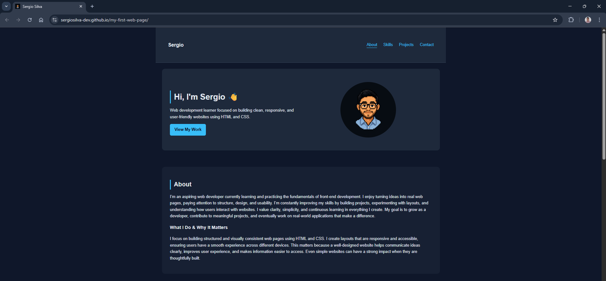
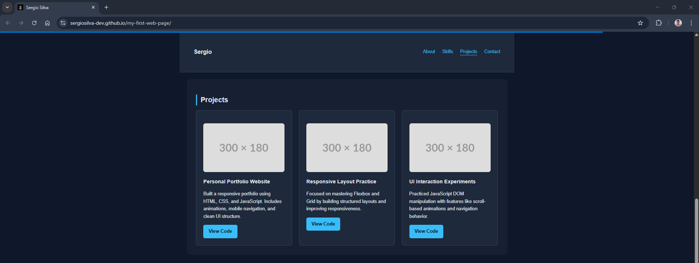

# 🌐 Personal Portfolio Website

This is my first personal portfolio project built from scratch to learn and practice **HTML, CSS, JavaScript, Git, and GitHub** following a structured development workflow.

## 🚀 Live Demo

👉 https://sergiosilva-dev.github.io/my-first-web-page/

---

## ✨ Features

- Responsive layout (mobile + desktop)
- Sticky navigation with smooth scrolling
- Scroll reveal animations using IntersectionObserver
- Active navigation link highlighting on scroll
- Mobile navigation menu with toggle and auto-close
- Scroll progress indicator
- Clean and modern UI design
- Dark mode support (based on system preference)

---

## 🛠️ Technologies Used

- HTML5
- CSS3 (Flexbox + Grid)
- JavaScript (DOM manipulation + IntersectionObserver)
- Git & GitHub
- GitHub Pages (deployment)

---

## 📚 What I Learned

- Structuring a real web project
- Building responsive layouts
- Implementing interactive UI with JavaScript
- Using IntersectionObserver for performance-friendly animations
- Managing code with Git branches and merges
- Deploying a website using GitHub Pages

---

## 📸 Screenshots

### 🏠 Hero Section



### 💼 Projects Section



### 📬 Contact Section


---

## 📬 Contact

- 📧 Email: [sergiosilvamarti@gmail.com](mailto:sergiosilvamarti@gmail.com)
- 💻 GitHub: https://github.com/sergiosilva-dev
- 🔗 LinkedIn: https://linkedin.com/in/sergiosilva-dev

---

## ⚙️ How to Run Locally

```bash
git clone https://github.com/sergiosilva-dev/my-first-web-page.git
cd my-first-web-page
```

Then open `index.html` in your browser.

---

## 🎯 Purpose

This project is part of my learning journey to become a professional web developer, focusing on building real-world projects with clean code and structured workflows.
